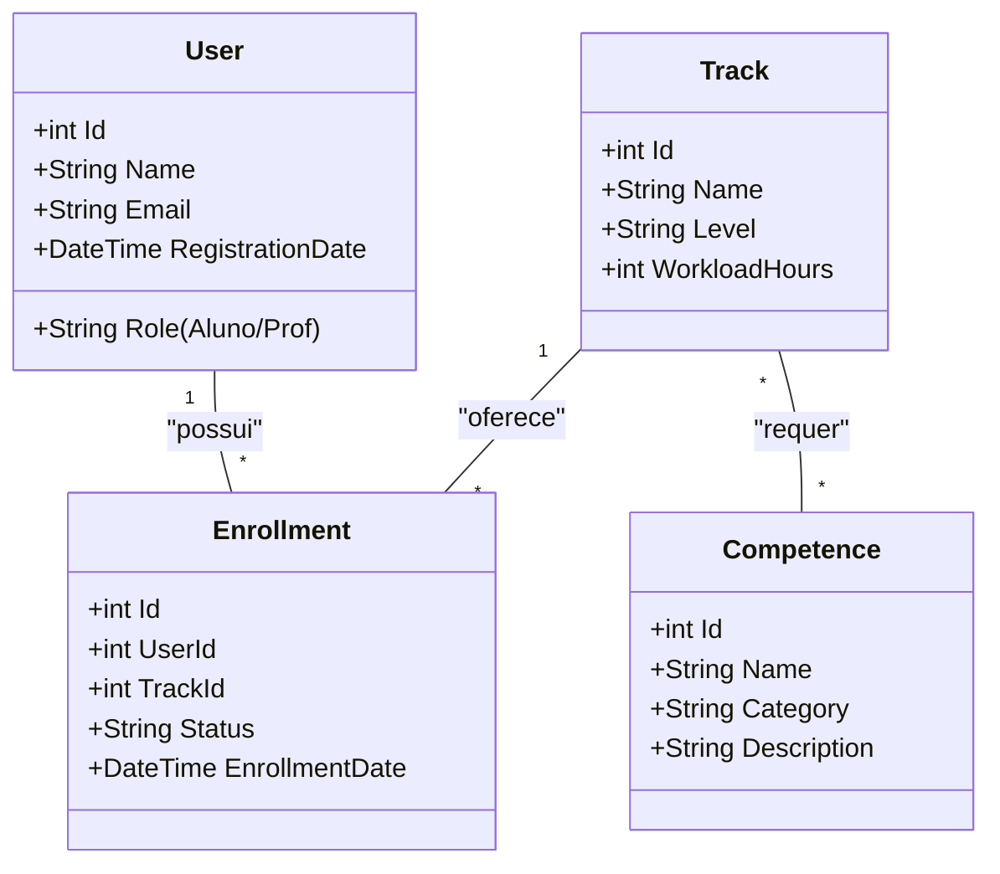
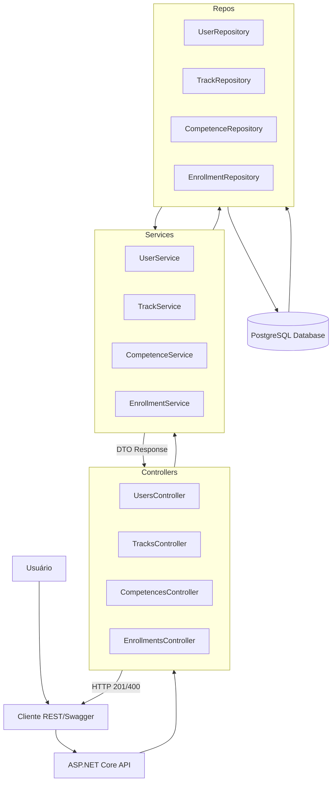

# 🌐 Global Solution - SkillBridge: Plataforma de Upskilling e Reskilling (O Futuro do Trabalho)

O SkillBridge é uma solução de educação móvel construída em React Native + Expo que atende à demanda global por Upskilling (aprimoramento) e Reskilling (requalificação), preparando profissionais para o mercado de trabalho impulsionado pela Inteligência Artificial e Automação (2030+).

A plataforma integra serviços robustos de autenticação, persistência de dados em nuvem (Firebase/Firestore) e comunicação com APIs externas, fornecendo uma experiência fluida e moderna ao usuário.

### Integrantes (Turma 3ESPY - 2025)
| Nome | RM |
| :--- | :--- |
| André Lambert | 99148 |
| Felipe Cortez | 99750 |
| Guilherme Morais | 551981 |


## 🎯 1. Contexto e Objetivo do Projeto
O cerne do SkillBridge é o combate ao gap de competências. Ao invés de ser apenas um catálogo de cursos, ele é um sistema estruturado para a requalificação:

* Reskilling (Requalificação): Oferece trilhas completas (mais de 15), como "Machine Learning" ou "Análise de Dados", permitindo que o usuário mude o foco da sua carreira para áreas de alta demanda.

* Upskilling (Aprimoramento): Foca em módulos específicos para elevar o nível de habilidades já existentes (ex: aprimorar soft skills ou dominar uma nova ferramenta de dados).

* ODS e Impacto: A solução está diretamente alinhada aos ODS 4 e 8, promovendo a educação contínua e um crescimento econômico inclusivo através da tecnologia.

Este projeto envolve um aplicativo mobile em **React-native** e desenvolve uma **API RESTful** desenvolvida em C#, para uma plataforma de **Upskilling/Reskilling** focada em preparar profissionais para as demandas do mercado de trabalho de 2030, impulsionadas por IA, Automação e Análise de Dados.

### 🔑 Recursos Principais
A API gerencia os seguintes recursos:
1.  **Users (Usuários):** Gerencia os profissionais cadastrados, incluindo um sistema de hierarquia (`Aluno`, `Professor`, `Administrador`).
2.  **Tracks (Trilhas de Aprendizagem):** Gerencia os cursos e suas relações com as competências futuras.
3.  **Enrollments (Matrículas):** Gerencia a relação direta entre Usuários e Trilhas.
4.  **Competences (Competencias):** Gerencia relações com competencias  das trilhas.

## 2. 🛠️ Especificações Técnicas e Arquitetura

### Linguagem e Frameworks
| Item | Descrição |
| :--- | :--- |
| **Linguagem** | C# |
| **Framework** | ASP.NET Core 8.0 |
| **Persistência** | Entity Framework Core (EF Core) |
| **Banco de Dados** | PostgreSQL (Supabase Cloud) |
| **Driver** | Npgsql.EntityFrameworkCore.PostgreSQL |
| **Arquitetura** | **Em Camadas:** `Controller` ➔ `Service` (Regras de Negócio) ➔ `Repository` (Acesso a Dados) |
| **Versioning** | Implementado via rotas: `/api/v1/...` |

Banco de dados secundario: "inMemory"
Driver: Microsoft.EntityFrameworkCore.InMemory

## 3. 💾 Configuração e Execução Local

### Pré-Requisitos
1.  **SDK .NET 8:** Instale a versão mais recente do .NET 8 SDK.
2.  **Visual Studio 2022** (Recomendado).
3.  **Supabase/PostgreSQL:** Uma base de dados PostgreSQL deve estar acessível e com as credenciais prontas.

### 3.1. Configuração do Banco (Switcher)

O projeto está configurado com um "Switcher" no `appsettings.json` para alternar entre o modo de desenvolvimento (`InMemory`) e o modo de produção (`Supabase`).

1.  Abra o arquivo `appsettings.json`.
2.  No campo `ConnectionStrings:SupabaseDb`, insira a string de conexão ADO.NET (copiada do arquivo anexado a entrega no teams).
3.  Para rodar com o Supabase, garanta que:
    ```json
    "UseDatabase": "Supabase"

    "SupabaseDb": "String de conexão aki"
    ```

### 3.2. Rodando as Migrações

Para criar as tabelas no Supabase, utilize o **Console do Gerenciador de Pacotes** no Visual Studio:

```bash
# 1. Cria o script de migração (se necessário)
Add-Migration FinalSchemaUpdate

# 2. Executa o script no banco de dados Supabase
Update-Database


# 3. Iniciando a API

Após configurar o banco, utilize o Visual Studio (F5) ou a linha de comando:

dotnet run
```

A API será iniciada na porta padrão (http://localhost:7xxx) e a documentação estará acessível via http://localhost:7xxx/swagger/index.html.

## 4. 🔗 Endpoints da API RESTful

A API segue o padrão RESTful (verbos HTTP e status codes).

| Recurso | Verbo | URL | Descrição | Status Codes |
| :--- | :--- | :--- | :--- | :--- |
| **Usuário** | `POST` | `/api/v1/users` | Cria um novo usuário (Aluno, Professor). | 201, 400 |
| **Trilha** | `GET` | `/api/v1/tracks` | Lista todas as trilhas disponíveis. | 200 |
| **Matrícula** | `POST` | `/api/v1/enrollments` | Matrícula um User em uma Track. | 201, 400, 404 |
| **Relação** | `POST` | `/api/v1/tracks/{id}/competences` | Adiciona uma Competência a uma Trilha. | 200, 400, 404 |

### Exemplo de Requisições

### 📋 Exemplos Detalhados de Requisições da API

| Recurso / Ação | Verbo | URL | Descrição e Payload Necessário |
| :--- | :--- | :--- | :--- |
| **1. USUÁRIO** (Criação) | `POST` | `/api/v1/users` | Cria um novo usuário (Aluno, Professor, Administrador). |
| | | | **BODY:** `{"name": "Novo User", "email": "novo@gs.com", "role": "Professor", "areaOfExpertise": "DevOps", "careerLevel": "Pleno"}` | |
| **Usuário** (Consulta) | `GET` | `/api/v1/users/{id}` | Busca um usuário pelo seu ID (Ex: `/users/1`). |
| **Usuário** (Atualização) | `PUT` | `/api/v1/users/{id}` | Atualiza todos os dados de um usuário existente. |
| | | | **BODY:** `{"id": 1, "name": "User Atualizado", "email": "user.atualizado@gs.com", "role": "Professor", "areaOfExpertise": "DevOps", "careerLevel": "Senior"}` | |
| **Usuário** (Deleção) | `DELETE` | `/api/v1/users/{id}` | Remove um usuário pelo ID. |
| | | | **BODY:** *Nenhum.* | |
| **2. TRILHA** (Criação) | `POST` | `/api/v1/tracks` | Cria uma nova trilha de aprendizado. |
| | | | **BODY:** `{"name": "Data Science", "level": "AVANCADO", "workloadHours": 80, "mainFocus": "Dados"}` | |
| **Trilha** (Atualização) | `PUT` | `/api/v1/tracks/{id}` | Atualiza os dados de uma trilha. |
| | | | **BODY:** `{"id": 1, "name": "Data Science A.", "level": "AVANCADO", "workloadHours": 90, "mainFocus": "Dados"}` | |
| **3. COMPETÊNCIA** (Criação) | `POST` | `/api/v1/competences` | Cria uma nova competência/skill. |
| | | | **BODY:** `{"name": "Soft Skills", "category": "Humana", "description": "Comunicação e Empatia"}` | |
| **4. MATRÍCULA** (Criação) | `POST` | `/api/v1/enrollments` | Matrícula um usuário em uma trilha. |
| | | | **BODY:** `{"userId": 1, "trackId": 2, "status": "ATIVA"}` | |
| **Matrícula** (Consulta) | `GET` | `/api/v1/users/{id}/enrollments` | Lista todas as matrículas ativas de um usuário. |
| | | | *Consulta feita pelo ID do Usuário na URL.* | |
| **5. RELAÇÃO N:N** (Linkar tracks) | `POST` | `/api/v1/tracks/{id}/competences` | Adiciona uma competência existente a uma trilha existente. |
| | | | **BODY:** `{"competenceId": 3}` (ID da competência a ser linkada) | |

# 5. Diagrama do projeto

## Diagrama de classes

## Fluxograma

